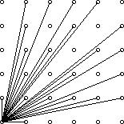

# 1047 - Visible Lattice Points

**Description**

A lattice point (x, y) in the first quadrant (x and y are integers greater than or equal to 0), other than the origin, is visible from the origin if the line from (0, 0) to (x, y) does not pass through any other lattice point. For example, the point (4, 2) is not visible since the line from the origin passes through (2, 1). The figure below shows the points (x, y) with 0 <= x, y <= 5 with lines from the origin to the visible points.  Write a program which, given a value for the size (N), computes the number of visible points (x, y) with 0 <= x, y <= N.

**Input specification**

The first line of input contains a single integer C (1 <= C <= 10^3) which is the number of datasets that follow. Each dataset consists of a single line of input containing a single integer N (1 <= N <= 10^3), which is the size.

**Output specification**

For each dataset, there is to be one line of output consisting of: the dataset number starting at 1, a single space, the size, a single space and the number of visible points for that size.

**Sample input**

4  
2 
4 
5 
231 

**Sample output**

1 2 5 
2 4 13 
3 5 21 
4 231 32549 