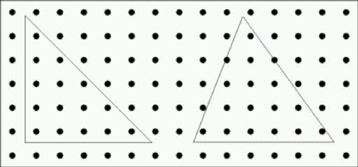

# 1081 - A Orchard Planting

**Description**

An Orchardist has planted an orchard in a rectangle with trees uniformly spaced in both directions. Thus the trees form a rectangular grid and we can consider the trees to have integer coordinates. The origin of the coordinate system is at the bottom left of the following diagram:

 
Consider that we now overlay a series of triangles on to this grid. The vertices of the triangle can have any real coordinates in the range 0.0 to 100.0, thus trees can have coordinates in the range 1 to 99. Two possible triangles are shown. Write a program that will determine how many trees are contained within a given triangle. For the purposes of this problem, you may assume that the trees are of point size, and that any tree (point) lying exactly on the border of a triangle is considered to be in the triangle.

**Input specification**

Input will consist of a series of lines. Each line will contain 6 real numbers in the range 0.00 to 100.00 representing the coordinates of a triangle. The entire file will be terminated by a line containing 6 zeroes (0 0 0 0 0 0).

**Output specification**

Output will consist of one line for each triangle, containing the number of trees for that triangle **right justified in a field of width 4 (we use '-' only for format reasons, but you must print white spaces instead of them**).

**Sample input**
 
1.5 1.5 1.5 6.8 6.8 1.5 
10.7 6.9 8.5 1.5 14.5 1.5 
0 0 0 0 0 0 

**Sample output**
 
--15 
--17 
