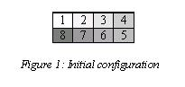
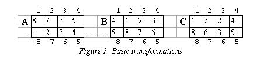

# 1107 - Magic Squares

**Description**

Following the success of the magic cube, Mr. Rubik invented its planar version, called magic squares. This is a sheet composed of 8 equal-sized squares (see Figure 1). In this task we consider the version where each square has a different colour. Colours are denoted by the first 8 positive integers (see Figure 1). A sheet configuration is given by the sequence of colours obtained by reading the colours of the squares starting at the upper left corner and going in clockwise direction. For instance, the configuration of Figure 1 is given by the sequence (1,2,3,4,5,6,7,8). This configuration is the initial configuration. Three basic transformations, identified by the letters 'A', 'B' and 'C', can be applied to a sheet: 'A': exchange the top and bottom row, 'B': single right circular shifting of the rectangle, 'C': single clockwise rotation of the middle four squares. All configurations are available using the three basic transformations. The effects of the basic transformations are described in Figure 2. Numbers outside the squares denote square positions. If a square in position p contains number i, it means that after applying the transformation, the square whose position was i before the transformation moves to position p. You are to write a program that computes a sequence of basic transformations that transforms the initial configuration of Figure 1 to a specific target configuration (Subtask A). Two extra points will be given for the solution if the length of the transformation sequence does not exceed 300 (Subtask B).

**Input specification**

The imput file contains 8 positive integers in the first line, the description of the target configuration.

**Output specification**

On the first line of the output your program must write the length L of the transformation sequence. On the following L lines it must write the sequence of identifiers of basic transformations, one letter in the first position of each line.

**Sample input**

2 6 8 4 5 7 3 1

**Sample output**

7 
B 
C 
A 
B 
C 
C 
B 