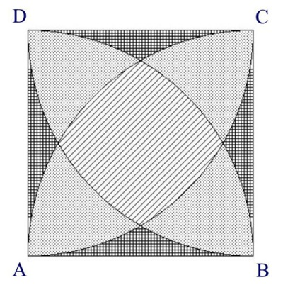

1109 - Is This Integration ?

**Description**

In the image below you can see a square **ABCD**, where **AB = BC = CD = DA = a**. Four arcs are drawn taking the four vertexes **A**, **B**, **C**, **D** as centers and a as the radius. The arc that is drawn taking **A** as center, starts at neighboring vertex **B** and ends at neighboring vertex **D**. All other arcs are drawn in a similar fashion. Regions of three different shapes are created in this fashion. You will have to determine the total area if these different shaped regions. The value used on this problem of the constant **PI** was **3.141592653589793**.

**Input specification**

The input file contains a real number a **(0 <= a <= 10^4)** in each line which indicates the length of one side of the square. Input is terminated by end of file.

**Output specification**

For each line of input, output in a single line the total area of the three types of region (filled with different patterns in the image above). These three numbers will of course be floating point numbers with three digits after the decimal point. First number will denote the area of the striped region, the second number will denote the total area of the dotted regions and the third number will denote the area of the rest of the regions.

**Sample input**

0.1 
0.2 
0.3 

**Sample output**

0.003 0.005 0.002 
0.013 0.020 0.007 
0.028 0.046 0.016 