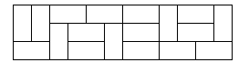

# 1113 - Tri Tiling

**Description**

In how many ways can you tile a 3xN rectangle with 2x1 dominoes? Here is a sample tiling of a 3x12 rectangle.

**Input specification**

Input consists of several test cases followed by a line containing -1. Each test case is a line containing an integer **0 <= N <= 30**.

**Output specification**

For each test case, output one integer number giving the number of possible tilings.

**Sample input**
 

2 
8 
12 
-1 

**Sample output**
 

3 
153 
2131 