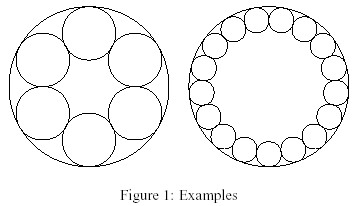

# 1122 - Yeehaa!

**Description**

George B. wants to be more than just a good American. He wants to make his daddy proud and become a western hero. You know, like John Wayne. But sneaky as he is, he wants a special revolver that will allow him to shoot more often than just the usual six times. This way he can fool and kill the enemy easily (at least that's what he thinks). George has kidnapped ... uh, I mean ... "invited" you and will only let you go if you help him with the math. The piece of the revolver that contains the bullets looks like this (examples for 6 and 17 bullets):

There is a large circle with radius **R** and **n** little circles with radius **r** that are placed inside on the border of the large circle. George wants his bullets to be as large as possible, so there should be no space between the circles. George will decide how large the whole revolver will be and how many bullets it shall contain.Your job is, given **R** and **n**, to compute **r**. The value used on this problem of the constant **PI** was **3.141592653589793**.

**Input specification**

The first line contains the number of scenarios. For each scenario follows a line containing a real number **R** and an integer **n**, with **1 <= R <= 100 and 2 <= n <= 100**.

**Output specification**

The output for every scenario begins with a line containing "Scenario #i:", where i is the number of the scenario starting at 1. Then print the value for **r**, rounded to three decimal places. Terminate the output for the scenario with a blank line.

**Sample input**
 

4 
4.0 6 
4.0 17 
3.14159 100 
42 2 

**Sample output**
 

Scenario #1: 
1.333 
 

Scenario #2: 
0.621 
 

Scenario #3: 
0.096 
 

Scenario #4: 
21.000 
