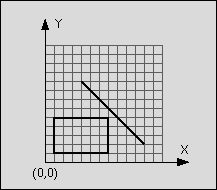

# 1127 - Intersection

**Description**

You are to write a program that has to decide whether a given line segment intersects a given rectangle. An example: line: start point: (4,9) end point: (11,2) rectangle: left-top: (1,5) right-bottom: (7,1) Figure 1: Line segment does not intersect rectangle...

The line is said to intersect the rectangle if the line and the rectangle have at least one point in common. The rectangle consists of four straight lines and the area in between. Although all input values are integer numbers, valid intersection points do not have to lay on the integer grid.

**Input specification**

The input consists of n test cases. The first line of the input file contains the number **n**. Each following line contains one test case of the format: **xstart ystart xend yend xleft ytop xright ybottom** where (**xstart**, **ystart**) is the start and (**xend**, **yend**) the end point of the line and (**xleft**, **ytop**) the top left and (**xright**, **ybottom**) the bottom right corner of the rectangle. The eight numbers are separated by a blank. The terms top left and bottom right do not imply any ordering of coordinates.

**Output specification**

For each test case in the input file, the output file should contain a line consisting either of the letter "T" if the line segment intersects the rectangle or the letter "F" if the line segment does not intersect the rectangle.

**Sample input**
 

1
4 9 11 2 1 5 7 1

**Sample output**
 

F